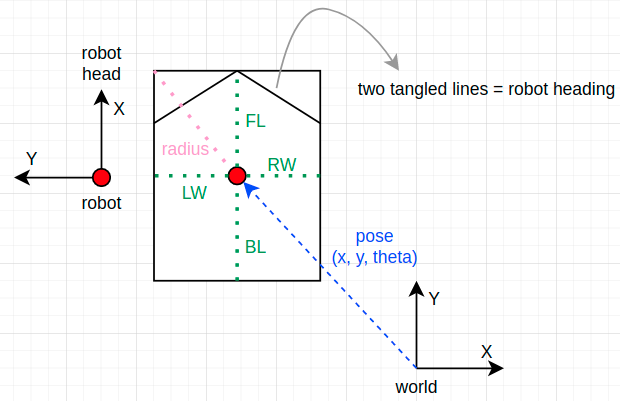
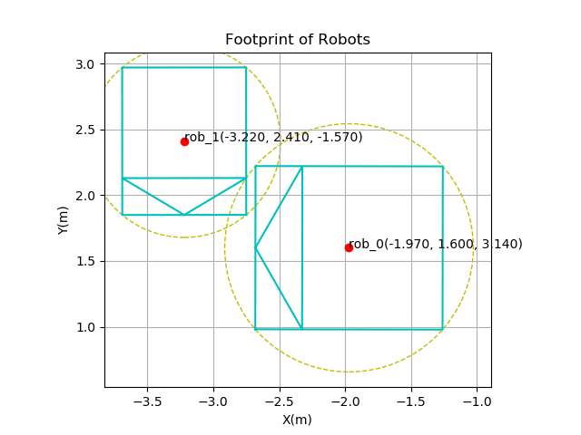

# Robot Footprint Plotter

### Purpose
- Plot footprint (include rotation) of robots

### HowTo
1. type in robots' footprint info in `input.yaml`
2. run `python3 robot_plotter.py`

### Terminology
- Pose: the description of the origin of robot coordinate seen from world coordinate.
- Footprint: the 2D projection shape of a robot.
- LW: Left Width.
- RW: Right Width.
- FL: Front Length.
- BL: Back Length.

### Example Output
